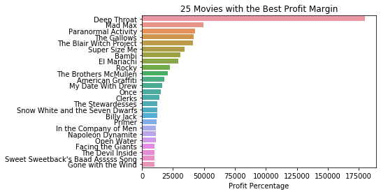
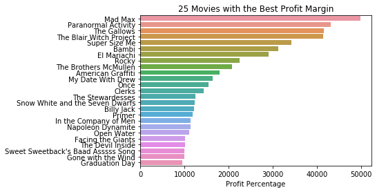
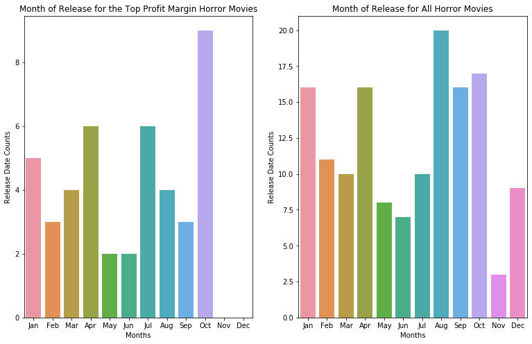
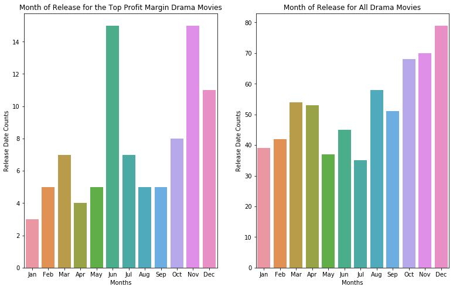
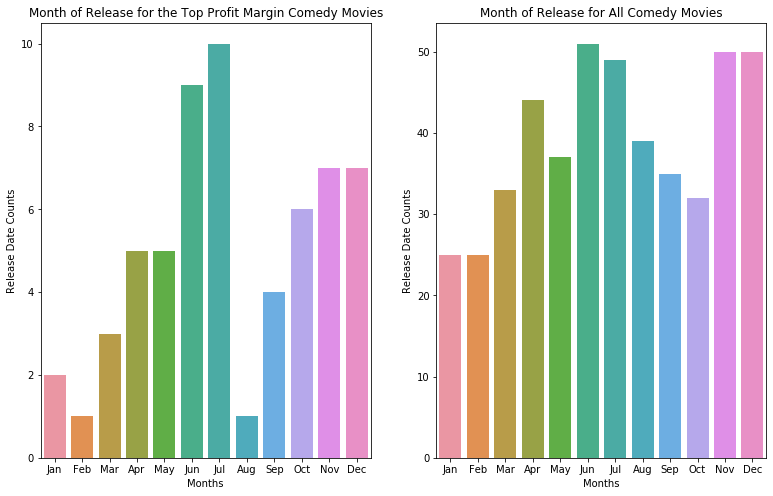

# Finding Success in the Movie Industry
## What does the Data tell us?


## Goals and Overview

In this project, I was given multiple datasets
* /zippedData/tmdb.movies.csv
* /zippedData/imdb.title.crew.csv
* /zippedData/tn.movie_budgets.csv
* /zippedData/imdb.title.ratings.csv
* /zippedData/imdb.name.basics.csv
* /zippedData/imdb.title.principals.csv
* /zippedData/imdb.title.akas.csv
* /zippedData/bom.movie_gross.csv
* /zippedData/imdb.title.basics.csv

The goal of this project is to conduct data analysis and create a presentation that explores what type of films are currently doing best in the box office. The findings must then be translated into actionable insights that could be used when creating a film that could increase the likelihood of a successful release.


------

# Question 1: Are there any noticeable trends in the data in terms of profit and profitability?


## Exploration (EDA)
The two graphs below show the top 25 movies in terms of gross profit and the top 25 movies in terms of gross profit margin.
The data analyzed actually used the top 50 movies, but the top 25 provided a visually cleaner visualization where trends can already be seen.
The top profit margin graph excludes Deep Throat, the highest profit margin movie ever, because it was such an outlier.





</details>

### Q1: Insights/Findings/Recommendations

**Findings**

After examining the top 50 movies for gross profit and gross profit margin, I found that 88% of the top 50 gross profit movies were sequels, prequels, remakes or built upon well established, extremely succesfully movie franchises and studios.
98% of the top 50 gross profit margin movies were novel concepts or ideas that were not built upon an already existing movie.

**Recommendations**
* Purchase well established franchise and create new movies upon the franchise for largest dollar amount returns.
* Create a movie from a succesful, original idea for best return on investment 


**Next Steps**
* Explore genres to see what genres tend to have the highest profit margin

# Question 2: Assuming we were to start a new movie from scratch, are there any trends that can help our movie have a high profit margin? Let's start by investigating if there are any trends for genre.


## Exploration (EDA)
The graph below shows the counts for each genre for the 500 movies with the highest gross profit margin.
The most represented genres were:

* Drama
* Comedy
* Horror

I initially tried the 50 movies with highest gross profit margin, but it did not have many data points. The 500 movies with highest gross profit margin gave a lot of data points.

## Some code I used to aggregate the genres by counts

```python
genre_count = {}
for movie in top_500profitp:
    movie_genres = joined_df[joined_df['movie']==movie]['genres'].values[0]
    try:
        for genre in movie_genres:
            genre_count[genre] = genre_count.get(genre, 0) + 1
    except:
        pass

genre_count
```


</details>

### Q2: Insights/Findings/Recommendations

**Findings**

After examining the top 500 movies for gross profit margin, I found the three most represented movie genres were Drama, Comedy and Horror (in order).

**Recommendations**
* If creating a new movie, use one of the genres from the findings (Drama, Comedy, Horror...) to increase chance of a higher profit margin
* Attempt to gather more data for more accurate results and better analysis; many of the data points did not have a genre listed


**Next Steps**
* Explore if there are advantageous release months for our most succesful genres in terms of top profit margin

# Q3: Are there any trends for the highest profit margin movies based on genre?


## Exploration (EDA)
The three graphs below show a comparison of the release months for movies by genre between all movies for that genre and movies that were in the 500 movies with the highest gross margin.

## The code below was used to group movies by genre that were in the 500 movies with the highest profit margin:

```python
top500horror = joined_df.loc[(joined_df['Horror'] == 1)  & (joined_df['profit_margin'] >= 0.879158)]['month']
top500drama = joined_df.loc[(joined_df['Drama'] == 1)  & (joined_df['profit_margin'] >= 0.879158)]['month']
top500comedy = joined_df.loc[(joined_df['Comedy'] == 1)  & (joined_df['profit_margin'] >= 0.879158)]['month']
```

## The months for each of those groupings were then counted and put into terms that could be visualized to make our graphs. Below we see the code used to group months for horror:

```python
horror_counts = {"Jan":0, "Feb":0, "Mar":0, "Apr":0, "May":0, "Jun":0, "Jul":0, "Aug":0, "Sep":0, "Oct":0, "Nov":0, "Dec":0 }
for month in top500horror:
    horror_counts[month] = horror_counts.get(month, 0) + 1
horror_count = list(horror_counts.items())
hy = [item[1] for item in horror_count]
hx = [item[0] for item in horror_count]
```







</details>

### Q3: Insights/Findings/Recommendations

**Findings**

After examining the release months of the top margin movie genres (Drama, Comedy, Horror) against all the movies for those same genres, I found that top profit margin horror movies tended to be released in October, top profit margin drama movies tended to be released in June and November compared to all movies of those genres. Top profit margin comedy movies tended to be released in June and July, much like their counterparts, but tended to trend towards the months of June and July more strongly.

**Recommendations**
* Collect genre information for all movies
* If creating a movie in the lowest performing genres, do not expect to gross over the budget.  
* If aiming at high gross, create action adventures movies.


**Next Steps**
* More in-depth statistical analysis for better understanding of the trends.  
* Same as for question 2, attempt to gather more genre data as many movies did not have any listed.
